This is the homework of [jserv](https://github.com/jserv)'s [Linux Kernel Internals](https://wiki.csie.ncku.edu.tw/linux/schedule).

Reference: [Linked list quiz 1](https://hackmd.io/@sysprog/linked-list-quiz)

<!--more-->

## Q1. 分析以下程式碼，推敲 FuncA, FuncB, FuncC 的作用，並且推測程式執行結果。


- 首先看到 struct node 為節點的結構，有一個 int 儲存資料，及一個 next pointer, prev pointer，因此可以推測其為一個雙向的 linked list

```c
struct node {
    int data;
    struct node *next, *prev;
};
```

### 1. FuncA 的作用是？

```c
void FuncA(struct node **start, int value) {
    if (!*start) {
        struct node *new_node = malloc(sizeof(struct node));
        new_node->data = value;
        new_node->next = new_node->prev = new_node;
        *start = new_node;
        return;
    }
    struct node *last = (*start)->prev;
    struct node *new_node = malloc(sizeof(struct node));
    new_node->data = value;
    new_node->next = *start;
    (*start)->prev = new_node;
    new_node->prev = last;
    last->next = new_node;
}
```

- If `*start` does not exist, malloc `*new_node` for it. And since the note will be an element of a doubly-linked list, the `*next` member should be `*new_node` itself if `*start` is `NULL`.
- If `*start` does exist, malloc and insert new node to tail.

So `FuncA` insert a new node to the tail of linked list `*start` (whether it's empty or not), the `node->value` is `value` given in function parameter.

#### Visualization the if block


`*start = new_node`


#### Visualization outside the if block

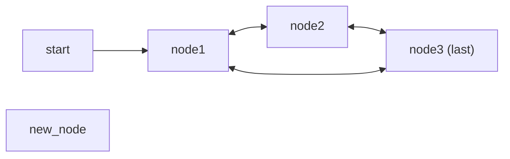

`new_node->next = *start` and `(*start)->prev = new_node`


`new_node->prev = last;` and `last->next = new_node;`
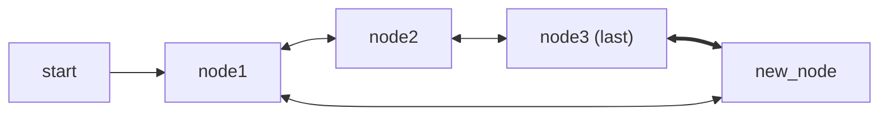

### 2. FuncB 的作用是？

```c
void FuncB(struct node **start, int value) {
    struct node *last = (*start)->prev;
    struct node *new_node = malloc(sizeof(struct node));
    new_node->data = value;
    new_node->next = *start;
    new_node->prev = last;
    last->next = (*start)->prev = new_node;
    *start = new_node;
}
```

`FuncB` insert a new node to the begining of the linked list `*start`, the `node->value` is `value` in function paramter.

Note that `*start` cannot be `NULL`.

#### Visualization of FuncB


`new_node->next = *start`
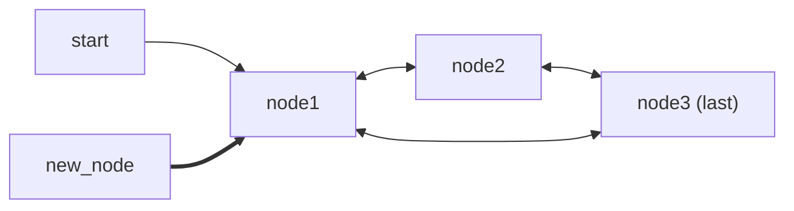

`new_node->prev = last`
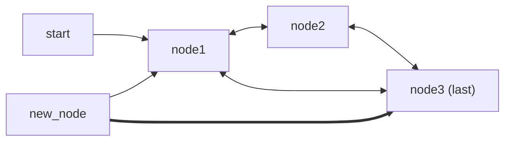

`last->next = (*start)->prev = new_node;`
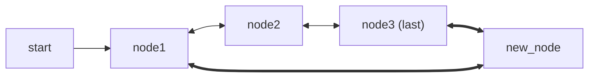

`*start = new_node;`
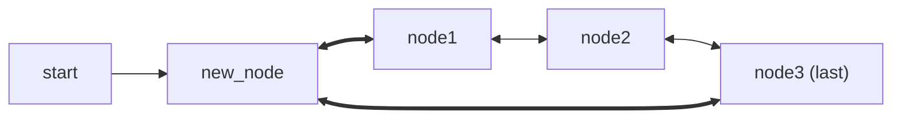

### 3. FuncC 的作用是？

```c
void FuncC(struct node **start, int value1, int value2) {
    struct node *new_node = malloc(sizeof(struct node));
    new_node->data = value1;
    struct node *temp = *start;
    while (temp->data != value2)
        temp = temp->next;
    struct node *next = temp->next;
    temp->next = new_node;
    new_node->prev = temp;
    new_node->next = next;
    next->prev = new_node;
}
```

Find the node with `data == value2`, if found, insert a node with `data == value1` after that node.

Note that `*start` cannot be `NULL`.

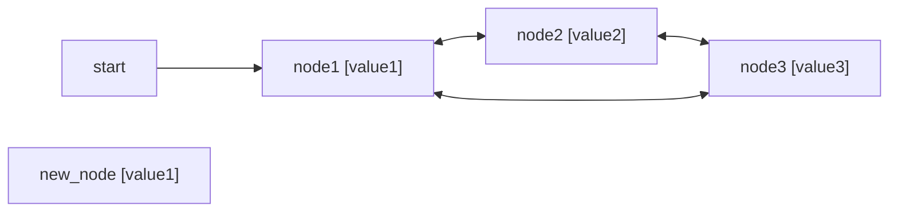

`struct node *temp = *start;`
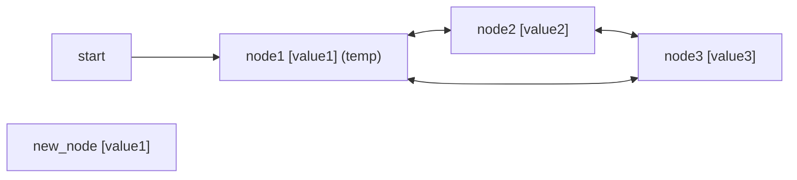

`while (temp->data != value2) temp = temp->next;`
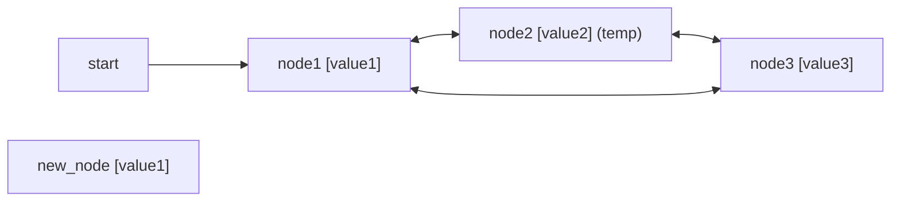


`struct node *next = temp->next;`
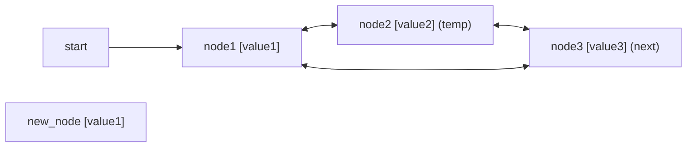


`temp->next = new_node; new_node->prev = temp;`
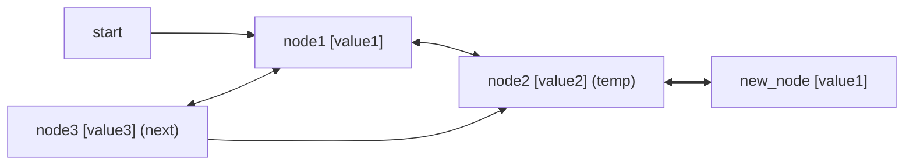


`new_node->next = next; next->prev = new_node;`
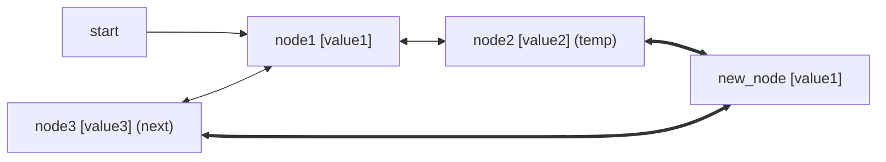


### 4. 在程式輸出中，訊息 Traversal in forward direction 後依序印出哪幾個數字呢？

```c
// q1.4~10
struct node *start = NULL; // *statr -> NULL
FuncA(&start, 51); // *statr -> 51
FuncB(&start, 48); // *statr -> 48 -> 51
FuncA(&start, 72); // *statr -> 48 -> 51 -> 72
FuncA(&start, 86); // *statr -> 48 -> 51 -> 72 -> 86
FuncC(&start, 63, 51); // *statr -> 48 -> 51 -> 63 -> 72 -> 86
display(start);
```

Answer: 48, 51, 63, 72, 86

> [!info]
>  延伸題目：在上述 doubly-linked list 實作氣泡排序和合併排序，並提出需要額外實作哪些函示才足以達成目標

I work out the exercise in [here](https://github.com/hfyeh/c-review/blob/214a08ee4546c1a560571e734532c16cc80761f4/linked_list_quiz.c#L50-L130).

## Q2. 考慮以下程式碼，推敲程式作用並分析輸出。


```c
#include <stdio.h>
#include <stdlib.h>

/* Link list node */
struct node {
    int data;
    struct node *next;
};

int FuncX(struct node *head, int *data) {
    struct node *node;
    for (node = head->next; node && node != head; node = node->next)
        (*data)++;
    return node - head;
}

struct node *node_new(int data) {
    struct node *temp = malloc(sizeof(struct node));
    temp->data = data; temp->next = NULL;
    return temp;
}

int main() {
    int count = 0;
    struct node *head = node_new(0);
    head->next = node_new(1);
    head->next->next = node_new(2);
    head->next->next->next = node_new(3);
    head->next->next->next->next = node_new(4);
    printf("K1 >> %s\n", FuncX(head, &count) ? "Yes" : "No");
    head->next->next->next->next = head;
    printf("K2 >> %s\n", FuncX(head, &count) ? "Yes" : "No");
    head->next->next->next->next->next = head->next;
    printf("K3 >> %s\n", FuncX(head, &count) ? "Yes" : "No");
    head->next = head->next->next->next->next->next->next->next->next;
    printf("K4 >> %s\n", FuncX(head, &count) ? "Yes" : "No");
    printf("K5 >> %d\n", head->next->data);
    printf("count >> %d\n", count);
    return 0;
}
```

### 1. FuncX 的作用是？

The `node && node != head` indicates the list could be a singlely linked list or a doubly linked list.

If it's a singlely linked list, the return value is not zero, and vice versa.

The `*data` denotes how long the for loop tranversed, for N elements, `*data` increases N+1.

### 2. K1 >> 後面接的輸出為何

Before K1, the linked list is singly linked.

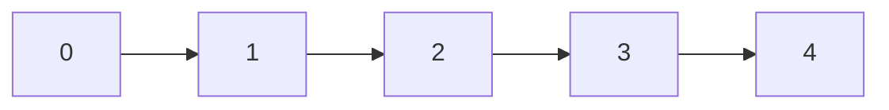

`FuncX` returns non-zero, `count == 4`

Ans: "Yes"

### 3. K2 >> 後面接的輸出為何

Before K2, the linked list is doubly linked.

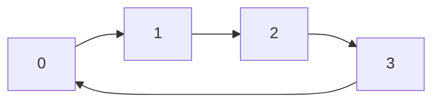

`FuncX` returns zero, `count == 4+3 == 7`

Ans: "No"

### 4. K3 >> 後面接的輸出為何

Before K3, the linked list is saem as K2. Additional code does not affect anything.

`FuncX` return zero, `count == 7 + 3 == 10`

Ans: "No"

### 5. K4 >> 後面接的輸出為何

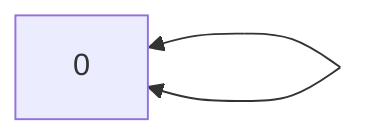

Ans: "No", `count == 10 + 0 == 10`

### 6. K5 >> 後面接的輸出為何

Ans: 0

### 7. count >> 後面接的輸出為何

Ans: 10
