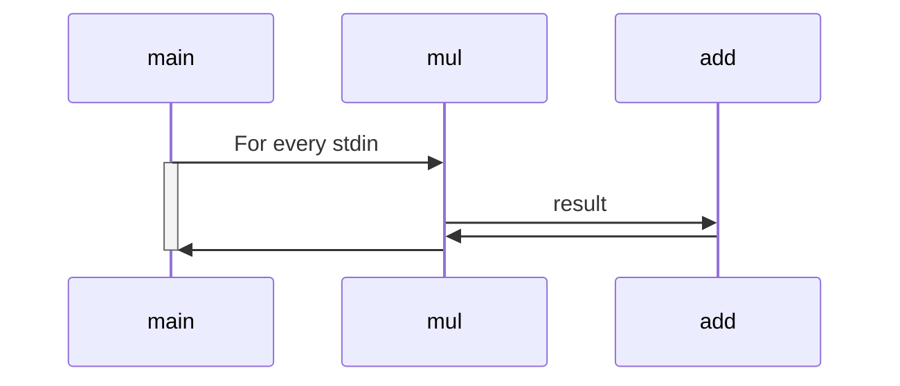

The CPython interpreter usese [GIL](https://wiki.python.org/moin/GlobalInterpreterLock) (global interpreter lock), to prevent threads from executing Python bytecodes at once.

Suppose I have two components who need to be run in parallel in a modern multi-core processor. Say, `add` and `mul`:

```python
def add(n: int) -> int:
    result = 0

    for i in range(n):
        result += (i + 1)

    return result


def mul(n: int) -> None:
    # Run many times to get longer execution period
    for x in range(4000000):
        result = 1

        for i in range(n):
            result *= (i + 1)

    return result
```

Impose that these two tiny components have to be run sequentially, `mul` recieves `add`'s output.



Run it twice and fix the input of `mul` to be 11 for demonstration purpose. Note here I print the time log to the standard error on purpose. The code is listed below.

<!--more-->

## Single Thread Version

```python
for i in range(2):
    x = mul(11)
    y = add(x)
```

Run it!
```shell
> time python3 0_single_thread.py
Time cost for mul 2.4840409755706787
Time cost for add 2.594242811203003
Time cost for mul 2.5620434284210205
Time cost for add 2.4484610557556152
python3 0_single_thread.py  9.81s user 0.01s system 97% cpu 10.111 total
```

Both of the two components cost about 2.5 s. (Since I choose the parameter 11 and the magic number 4000000.) The time needed for each iteration becomes long. Besides, while computing one of the components, the other cannot do any computation. The total time for finishing the loop on my machine should be around (2.5 + 2.5) * 2 = 10 s, and I got 11.111 s.


## Mult-thread Version
To assure the above sequence, I use Queue for messaging from main thread to `t1` (the `mul_with_time` thread) and `t2` (the `add_with_time` thread).

The main thread put `11` into `q1`, the `mul_with_time` pop the `q1` and do computation and put its result to `q2`, the `add_with_time` pop `q2` and do computation.

```python
def mul_with_time(q1: Queue, q2: Queue) -> int:
    round = 0
    while True and round < 2:
        n = q1.get()
        q2.put(mul(n))
        round += 1

def add_with_time(q: Queue) -> int:
    round = 0
    while True and round < 2:
        n = q.get()
        add(n)
        round += 1


if __name__ == '__main__':
    q1 = Queue()
    q2 = Queue()

    t1 = Thread(target=mul_with_time, args=(q1, q2), daemon=True)
    t2 = Thread(target=add_with_time, args=(q2,), daemon=True)
    t1.start()
    t2.start()

    for i in range(2):
        q1.put(11)

    t1.join()
    t2.join()
```

```shell
time python3 1_multi_thread.py 
Time cost for mul 2.5354559421539307
Time cost for mul 6.187425374984741
Time cost for mul 6.396909475326538
Time cost for mul 2.273833990097046
python3 1_multi_thread.py  11.17s user 0.02s system 99% cpu 11.228 total
```

The total time got even longer! The second round `mul_with_time` and the first round `add_with_time` are **2.5x** because these two threads runs simultaneously. Since there is a GIL, only one of them is actually executed at any given moment. And since there is a context switch when transit from one thread to the other, the time for both threads should be more than 2.5 + 2.5 = 5 s.

This multi-thread version is a good practice since I have isolated the two components, this archetecture makes it possible to execute them concurrently (not parallel).


## Multi-process Version
Spawning sub-processes for both components can readily avoid them from blocking each other. Simply replace `multithreading.Thread` by `multiprocessing.Process` and `queue.Queue` by `multiprocessing.Queue` will turn this script from multi-thread version to multi-process version.

```shell
time python3 2_multi_process.py
Time cost for mul 2.4805655479431152
Time cost for mul 2.2870962619781494
Time cost for mul 2.4712436199188232
Time cost for mul 2.320164918899536
python3 2_multi_process.py  9.58s user 0.02s system 131% cpu 7.313 total
```

This time no heavy context switches are present. Each sub-process holds its own GIL and blocks no one. First round `add_with_time` and second round `mul_with_time` are executed in parallel, i.e. both of them are actually running at a given moment. The total time should be 2.5 + 2.5 + 2.5 = 7.5 s.


## Multi-process with shell
The work is done. But when I staring at the `2_multi_process.py` script, I found that although `mul_with_time` and `add_with_time` are well separated, there are many _fancy_ stuff in my main function. For example, `Process` and `Queue` are objects that may make other programmers confused at first glance, they are not what I really concern and are not necessary actually.

`Process` can be replaced by shell, and `Queue` can be replaced by pipeline `|`. Pipe first component's standard output to second component's standard input will make it.

3_mp_mul.py
```python
for i in range(2):
    print(mul(11), flush=True)
```

3_mp_add.py
```python
while True and round < 2:
    stdin = sys.stdin.readline().rstrip()

    if (stdin == ''):
        continue
    else:
        result = add(int(stdin))
        round += 1
```

Now the two components are even more isolated. In this version, each script is just a main function which listen to the standard input, do single component and then print something to its standard output. (Yes, you can change the first script so that it can listen to standard input too.)

And I get the same performance as the previous version.

```shell
time (python3 3_mp_mul.py | python3 3_mp_add.py)
Time cost for mul 2.516085386276245
Time cost for add 2.300935745239258
Time cost for mul 2.5419352054595947
Time cost for add 2.2685813903808594
( python3 3_mp_mul.py | python3 3_mp_add.py; )  9.64s user 0.02s system 131% cpu 7.349 total
```

The parenthesis that enclosing two Python processes is to create a shell sub-process so that the total time of this sub-process (which creates two processes) can be recorded.

Imagining that you and your teammates are developing a series of algorithm like `sum` and `add` which have to be run sequentially and the output of the former is the input of the latter, this architecture frees you from interference each other. You can develop, test your own component, you can also combine it with other components by a pipeline. Neat, right?

You can [downlaod](https://github.com/hfyeh/concurrent_python) these scripts and run it yourself.
