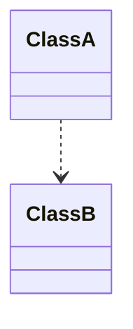
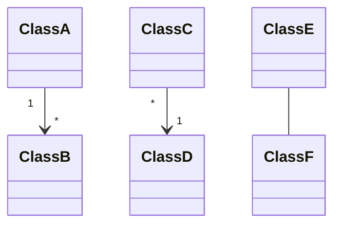
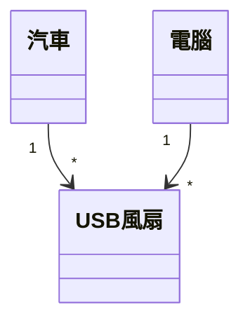
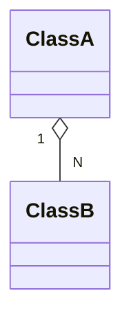
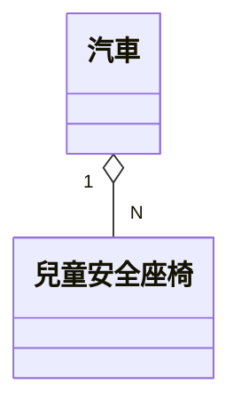
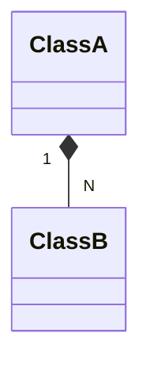
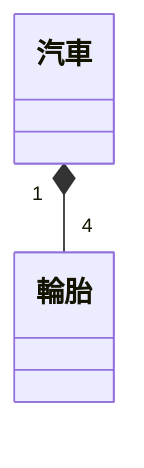
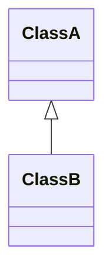
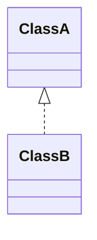

這是一篇學習 UML class diagram 的簡記。為保持文意清晰和，用到術語時盡可能使用原文表示。

<!--more-->

### Dependency （依賴）

- 定義：影響為單向。如 A 的變化不影響 B，B 的變化會影響 A，則 A 依賴 B。
- 圖例：虛線連結，單向箭頭，由依賴方指向被依賴方。

- UML syntax
```shell
classDiagram
    ClassA ..> ClassB
```
- 依賴關係是比較廣泛的描述，如下面的 Inheritance 和 Asscociation 也可以視為一種 Dependency，只是將這些比較常見且重要的依賴形式獨立出來便於使用。


### Association

- 定義：廣義來說，Association 是包含 Aggregation 和 Composition 的，後二者是一種特化。若 A 與 B 之間可獨立存在，若 A 對 B 有存取權，則 A asscociates with B。Association 可以是雙向的。
- 圖例：實線連結，箭頭從擁有者指向被擁有者。雙向連結時省略箭頭。

- UML syntax
```shell
classDiagram
    ClassA "1" --> "*" ClassB
    ClassC "*" --> "1" ClassD
    ClassE -- ClassF
```
- 與 Aggregation, Composition 的相異處在於，Association 的類之間可以是對等的，也可以是從屬關係。習慣上我會直接將具有從屬關係的類用 Aggregation 或 Composition 表示，將對等關係的類保留給 Association。
- 實例：一部汽車可以有一至多個 USB 風扇。電腦也可以有一至多個 USB 風扇。USB 風扇本身也可以單獨存在，甚至插到其他提供 USB 的插座上。



### Aggregation

- 定義：表示 A 與 B 有從屬（主體與附屬）關係。若 A 包含 B，但 B 可以被共享，則 A aggreates B。
- 圖例：實線連結，空心菱形頭指向整體。

- UML syntax
```shell
classDiagram
    ClassA "1" o-- "N" ClassB
```
- 與 Composition 的相異處，在於 Aggrestion 的附屬類可以被共享，生命週期也不須與主體類相同。
- 實例：一部汽車可以一至多個兒童安全座椅。每個兒童安全座椅只能附屬於汽車。一台座椅可以登記在幾台常用的車上，隨時可以拆換到其他車上使用。



### Composition

- 定義：表示 A 與 B 有從屬（主體與附屬）關係。若 A 包含 B，且 A 的完整性需要 B 才能完成，則 A is composed of B。
- 圖例：實線連結，實心菱形頭指向整體。

- UML syntax
```shell
classDiagram
    ClassA "1" *-- "N" ClassB
```
- 與 Composition 的相異處，在於 Composition 的主體與附屬無法單獨存在，生命週期相同。
- 實例：一部汽車有四顆輪胎，但若沒有輪胎，車子就不完整。車子報銷後，輪胎也會跟著被回收或丟棄。（假設沒有被黑心廠商拿去裝到別的車上）


### Inheritance (Generalization) （繼承）

- 定義：B is a kind of A。A 為實體類，而 B 是 A 的一種特化。
- 圖例：實線連結，空心箭頭指向被特化的類。

- UML syntax
```shell
classDiagram
    ClassA <|-- ClassB
```
- 使用 PlantUML 可以畫出空心箭頭，但使用 Mermaid 只能畫出如下的實心箭頭，不論是 Refactoring: Improving the Design of Existing Code 一書中使用空心箭頭，在白板上作圖，都是空心箭頭比較方便。不知 Mermaid 為何只能畫出實心箭頭。


### Realization

- 定義：B realizes A。A 為通用的介面，而 B 實作該介面。
- 圖例：虛線連結，空心箭頭指向介面。

- UML syntax
```shell
classDiagram
    ClassA <|.. ClassB
```
- 與 inheritance 相同，一樣存在 Mermaid 無法畫出空心箭頭的問題。

